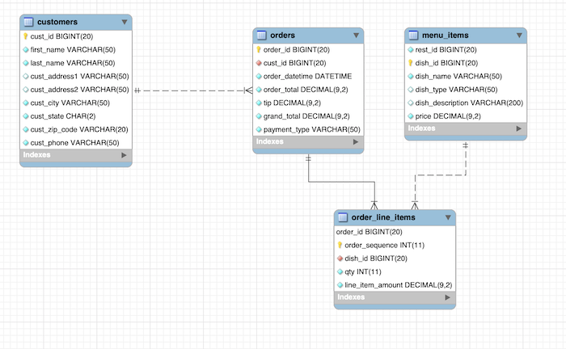
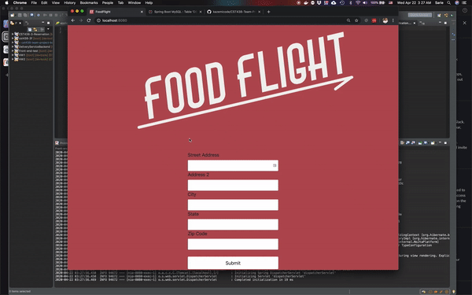
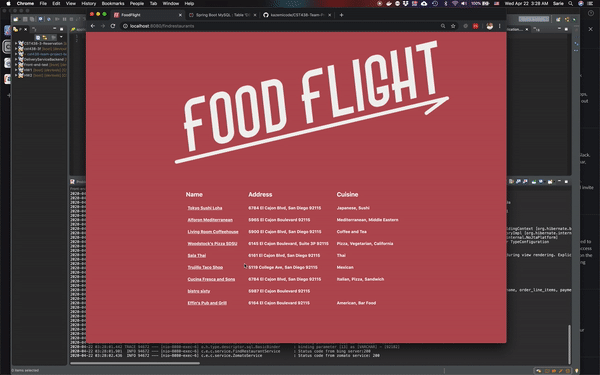
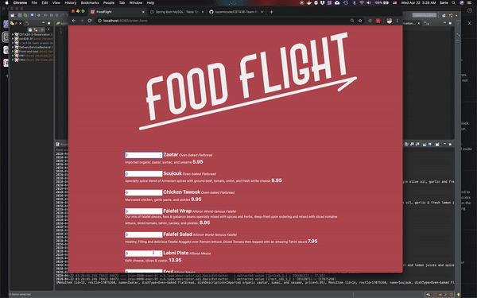
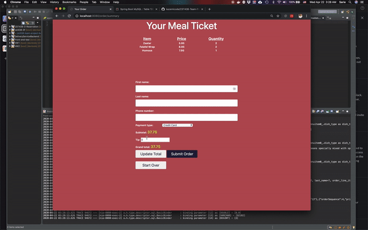
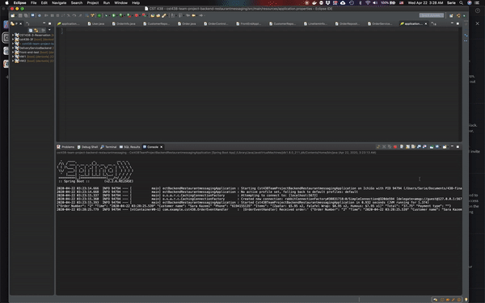
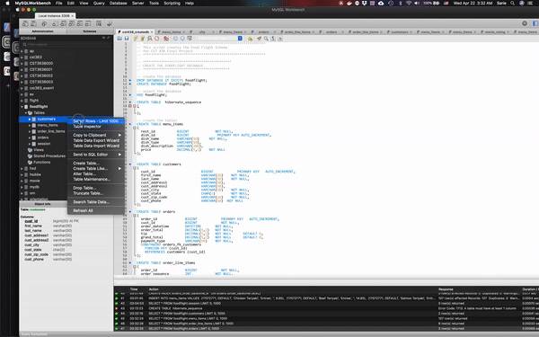

# CST 438 Team Project: Food Flight
*A web-based application based on Postmates designed and developed by:*

*Ryan Dorrity [@rdorrity](https://github.com/rdorrity/)*

*Sara Kazemi [@kazemicode](https://github.com/kazemicode/)*

*Nathan Warren-Acord [@nwarcord](https://github.com/nwarcord/)*

*Cody Young [@codyayoung](https://github.com/codyayoung/)*

## Deployment Setup
### Schema
Food Flight utilizes Zomato's REST API in order to retrieve restaurant information near a given geolocation (we use Bing Maps REST API as a middleman to convert addresses to lat/long geolocations). However, because no restaurant seems to utilize Zomato's menu item endpoint, we designed a schema with a table of menu items for select restaurants using the same restaurant_id values as the Zomato API. We also created tables to store a user's order details:
* `Customers` :: stores customer contact information
* `Orders` :: stores high-level order details
* `Order_Line_Items` :: stores each line item in the order 

In order to set-up the schema, run the [setup script](https://gist.github.com/kazemicode/4e6b2fd8ba1835620e99ca721159fc46#file-foodflight-sql) in MySQL Workbench.



## Application Properties
You will need to configure your application properties in order for the application to function correctly. You can copy and paste the following into your `application.properties` file located in the resources folder of the project (supplying your MySQL server credentials where indicated):

```#Bing and Zomato API url and keys
bing.url = http://dev.virtualearth.net/REST/v1/Locations/US/
bing.apikey = AoTedBk9ZXszjM-4lTlcHjLtLFHp1bh7bprAlwEDqtGH9j7J0DiuxEVw1Zh1EACe

#zomato server configuration
zomato.url = https://developers.zomato.com/api/v2.1/geocode
zomato.apikey = 72693bce953b0a29536cecb44e42007a


#DATASOURCE
spring.datasource.url=jdbc:mysql://localhost:3306/foodflight?useUnicode=true&useJDBCCompliantTimezoneShift=true&useLegacyDatetimeCode=false&serverTimezone=UTC
spring.datasource.username=YOURUSERNAME
spring.datasource.password=YOURPASSWORD
spring.datasource.driver-class-name=com.mysql.cj.jdbc.Driver

#Hibernate
spring.jpa.properties.hibernate.dialect = org.hibernate.dialect.MySQL5InnoDBDialect
spring.jpa.hibernate.ddl-auto=update 
```
## Run Front-end application and back-end services
Run this application as well as the back-end restaurant messaging and delivery person messaging services.

## Usage Limitations
Because no restaurants currently expose resources using Zomato's menu item endpoint, we had to generate a (relatively small) set of menu items for a subset of restaurants. Right now, the application is limited to 5 restaurants near **San Diego State University** and 5 restaurants near **CSU Monterey Bay**. Therefore, you must use one of those addresses to get restaurant results that have menu items.

## Sample Run
### Restaurant Search and Results
Using the address for San Diego State University, we retrieve nearby restaurants from Zomato's API: 




### Restaurant Menu/Order Page
Clicking on a desired restaurant will display its menu page, enabling the user to select quantities of items to add to their order:



### Order Summary
Clicking `Submit` on the Order page will display an Order Summary page for the user to review. The user must input their name, phone number, and tip amount before confirming their order. Alternatively, they can return to the beginning, which deletes the current session.


### Order Confirmation
Finally, after confirming the order, the user is notified that their order was a success and they are given an order confirmation number.


 It is at this point that their order details are stored to the front-end's database and messages are sent to the messaging microservices for the restaurant and for the delivery person.
 
 


### Updated Schema
Upon checkout, the schema is updated with the order information across the `customers`, `orders`, and `order_line_items` tables:



## Objectives:
### Practice Agile team procedures of iterative development: 
* Three weekly sprints
* Pair programming 
* Code reviews (via pull requests) 
* Utilize a version control system (Git/GitHub)
* Track and prioritize requirements with [Pivotal Tracker](https://www.pivotaltracker.com/n/projects/2440442) 
* JUnit test cases using MOCKS

### Use Service Oriented Architecture (SOA) design to implement two back end microservices and a front end
* The front end will use HTML-JavaScript web pages
* The front end will use REST to communicate with back end services
* Microservices use asynchronous communication (RabbitMQ message queues)to communicate with each other


## Requirements (User stories):
- [x] Upon visiting the website, user should see a front splash page that has a product logo and a "call to action" that will prompt user to search their area (via US address) for restaurants.
- [x] Upon submitting their address, user should see a list of restaurants in their area. User should be able to click on any restaurant in order to view its rendered ordering page.
- [x] Upon clicking a restaurant from the results page, user will see what items they can order from a restaurant. Each item should have a short description, the cost, and a field for quantity. 
User should be able to select the quantity of any item they desire. User can click on "submit order" after selecting the desired items.
- [x] Upon clicking "checkout" from the restaurant ordering page, user should see a summary of items they are about to order. Summary should include quantity and cost of each line item, a subtotal, tax, the delivery fee, and a grand total. User can click "submit order" or "start over". 
- [x] When user clicks "submit order" from cart summary, the order details are stored in the front-end's database and the user is notified that their order to (restaurant name) has been submitted. 
- [x] When user clicks "submit order" from cart summary, a Rabbit message is sent to a queue for a subscribed restaurant to receive via a back-end microservice
- [x] When user clicks "submit order" from cart summary, a Rabbit message is sent to a queue for a subscribed delivery person to receive via a back-end microservice
- [ ] Additional iced-boxed requirements on Pivotal Tracker
